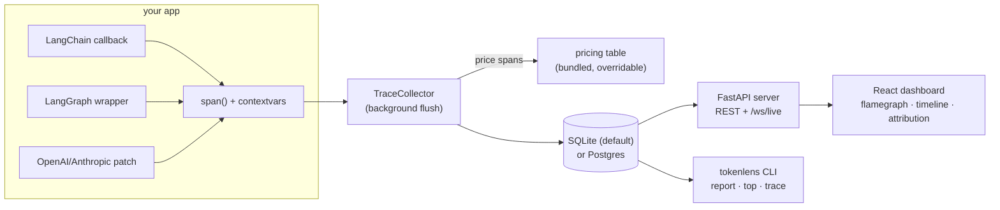

# tokenlens

**A flamegraph for token spend.**

Chrome DevTools for your AI pipeline: tokenlens traces LangChain/LangGraph
pipelines (and raw OpenAI/Anthropic SDK calls), prices every span, and shows
you — as a flamegraph — exactly which node, retry, user, and feature is
burning the budget. Local-first, zero-config, one `pip install`.

<!-- TODO: record with `make demo` -->


## Quickstart

```bash
pip install "tokenlens[all]"
```

```python
import tokenlens
from tokenlens.instrument.langchain import TokenLensCallbackHandler

tokenlens.init()  # optional — defaults to SQLite at ~/.tokenlens/traces.db
chain.invoke(query, config={"callbacks": [TokenLensCallbackHandler()]})
```

```bash
tokenlens server        # dashboard → http://127.0.0.1:8321
```

No API keys, no cloud account, no agent daemon. Traces flush to a local
SQLite file in the background; the dashboard reads the same file. Want to
see it with fake traffic first? `make demo`.

## Why

Every LLM app eventually asks the same three questions, and a flat request
log answers none of them:

1. **Which node in my graph is eating the budget?** Cost rolls up a trace
   tree the way CPU time rolls up a flamegraph — one glance shows the
   expensive subtree, not just an expensive total.
2. **What are retries costing me?** Retried calls are money spent re-doing
   failed work. tokenlens tracks `retry_index` on every span and reports
   retry waste as a headline number (and paints retries red).
3. **Which user or feature drives spend?** `set_user` / `set_feature` stamp
   attribution onto the context once; every descendant span inherits it, so
   cost breaks down by who and what — not just by model.

## Integrations

**LangChain** — attach the callback handler; spans nest exactly like
LangChain's own run graph, including retries:

```python
from tokenlens.instrument.langchain import TokenLensCallbackHandler

chain.invoke(query, config={"callbacks": [TokenLensCallbackHandler()]})
```

**LangGraph** — wrap a compiled graph once; every node execution becomes a
`GRAPH_NODE` span:

```python
import tokenlens
from tokenlens.instrument.langgraph import instrument_graph

agent = instrument_graph(builder.compile())
with tokenlens.span("my_agent"):
    agent.invoke(state)
```

**Raw OpenAI / Anthropic SDKs** — no framework required:

```python
import tokenlens.instrument

tokenlens.instrument.auto_patch()  # wraps openai/anthropic chat & messages create
```

**Anything else** — the primitives are public:

```python
with tokenlens.span("rerank", kind=tokenlens.SpanKind.TOOL):
    ...
```

Attribution works the same everywhere:

```python
tokenlens.set_user("ana@corp")
tokenlens.set_feature("checkout_assistant")
```

More detail in [docs/integrations.md](docs/integrations.md).

## Architecture



Spans are recorded via `contextvars` (correct across threads and asyncio),
buffered in-process, priced against a versioned per-model rate table, and
flushed to storage on a background thread — instrumentation never blocks or
breaks your app.

## vs LangSmith / Langfuse / Helicone

Honest version: those are excellent, broader products. tokenlens does one
thing — cost profiling — and optimizes everything for it.

|  | tokenlens | LangSmith | Langfuse | Helicone |
|---|---|---|---|---|
| Local-first, no account | ✅ SQLite file | ❌ cloud | ⚠️ self-host is a deployment | ⚠️ self-host is a deployment |
| Zero-config setup | ✅ one pip install | ❌ | ❌ | ⚠️ proxy swap |
| Cost flamegraph | ✅ native | ❌ | ❌ | ❌ |
| Retry-waste accounting | ✅ headline metric | ❌ | ❌ | ❌ |
| Per-user / per-feature cost | ✅ | ⚠️ via metadata | ✅ | ✅ |
| Prompt management, evals, datasets | ❌ | ✅ | ✅ | ⚠️ |
| Team/collab features, hosted UI | ❌ | ✅ | ✅ | ✅ |
| Gateway/caching features | ❌ | ❌ | ❌ | ✅ |

If you need evals, prompt registries, or a hosted team workspace, use one of
them (tokenlens happily coexists). If you want `pytest`-grade friction for
"where did the money go", that's us.

## CLI

```bash
tokenlens report --since 7d --group-by node   # cost table (also --json)
tokenlens top --n 10                          # most expensive traces
tokenlens trace <trace_id>                    # ASCII span tree, retries in red
tokenlens prune --older-than 30d              # retention
tokenlens pricing                             # the active rate table
```

## Docs

- [Quickstart](docs/quickstart.md)
- [Integrations](docs/integrations.md) — LangChain, LangGraph, raw SDKs, manual spans
- [Custom pricing](docs/custom-pricing.md) — negotiated rates, new models
- [Self-hosting](docs/self-hosting.md) — Postgres, retention, deployment

## Roadmap

- [ ] PyPI release
- [ ] Streaming/token-by-token cost for long-running generations
- [ ] OpenTelemetry export (spans already map cleanly)
- [ ] Budgets & alerts (`tokenlens watch --budget 50/day`)
- [ ] LiteLLM / Gemini / Bedrock instrumentation
- [ ] Sampling for high-volume production use

## Contributing

Dev setup, test commands, and PR guidelines live in
[CONTRIBUTING.md](CONTRIBUTING.md). Issues and PRs welcome — the
[demo agent](examples/demo_langgraph_agent.py) gives you a database full of
traces to hack against in one command.

## License

MIT
